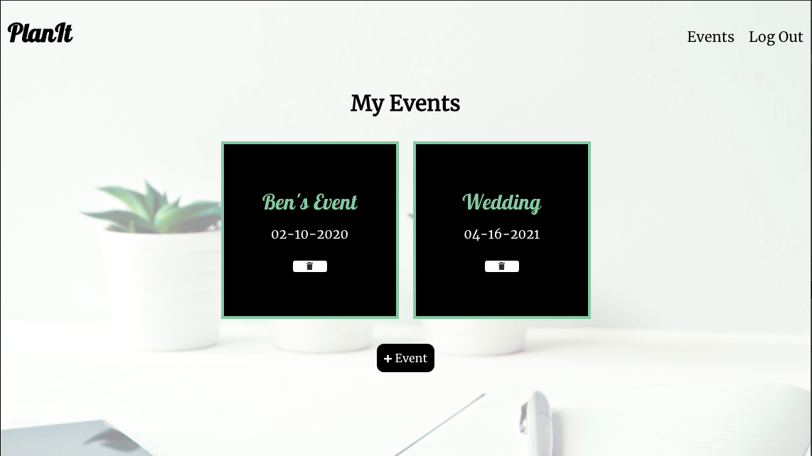
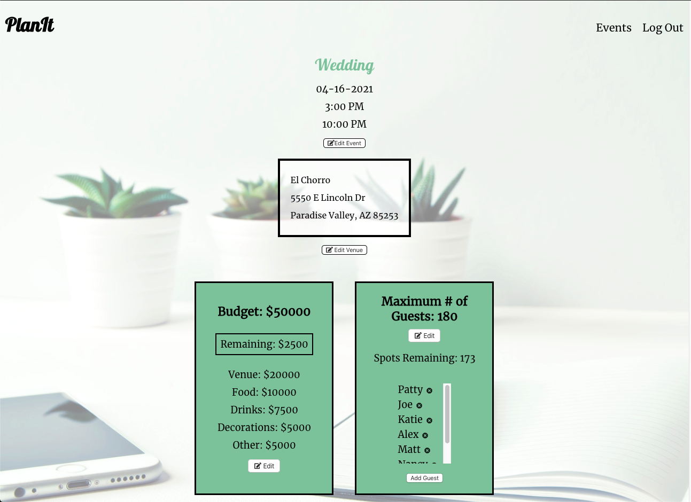
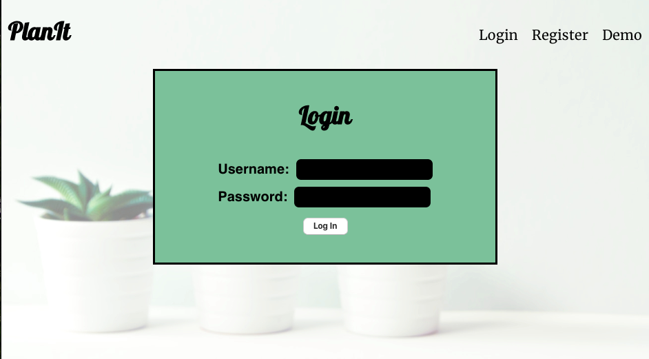
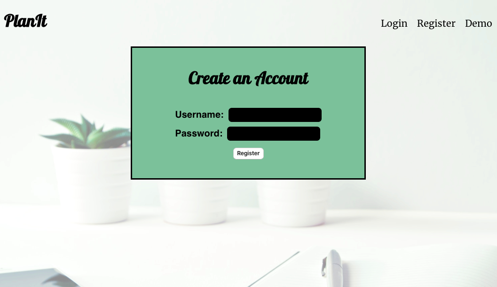

# PlanIt API

Link to Live App: https://plan-it.now.sh/

## PlanIt is a full-stack web based application that allows users to create an account and plan events like Weddings, Bachelor Parties, and more. 

 Users can login to view their Events, update the date & time, add a venue, manage the budget, and add guests to the guest list. They can also create new events and enter any known information, and add additional information at a later time. 

The PlanIt client makes calls to this API for user authentication, adding new users to the database, retreiving
a user's data, and manipulating said data.

## Built With:
- Node.js
- Express.js
- Knex
- PostgreSQL

## Endpoints

### Root Endpoint: https://lit-brushlands-47774.herokuapp.com/api

Note: user_id and Authorization need to be set as Headers for all requests to /events endpoints. The user_id and bearer token are returned from the /auth/login endpoint after successfully logging in. 

### /events
 - GET: Returns user's events formatted as JSON
 - POST: Adds a new event
 - Request Requirements:
    - Headers
        - Authorization: bearer [your jwt token]
        - user_id: [your user id]

 

### /events/:event_id
- GET: Returns a specific event from a user's events
- DELETE: Removes an event from a user's events
- PATCH: Edits an event
- Request Requirements:
    - Headers
        - Authorization: bearer [your jwt token]
        - user_id: [your user id]
    - Query Paramters
        - /event_id

 

### /auth/login
- POST: submits the username & password entered in the Login form
- Request requirements: 
    - Headers
        - content-type: application/json
    - Body
        - {user_name, password} formatted as JSON 

### /users
- POST: Registers a new username & password combination if the requirements are met
- Request Requirements:
    - Headers
        - content-type: application/json
    - Body
        - {user_name, password} formatted as JSON

 